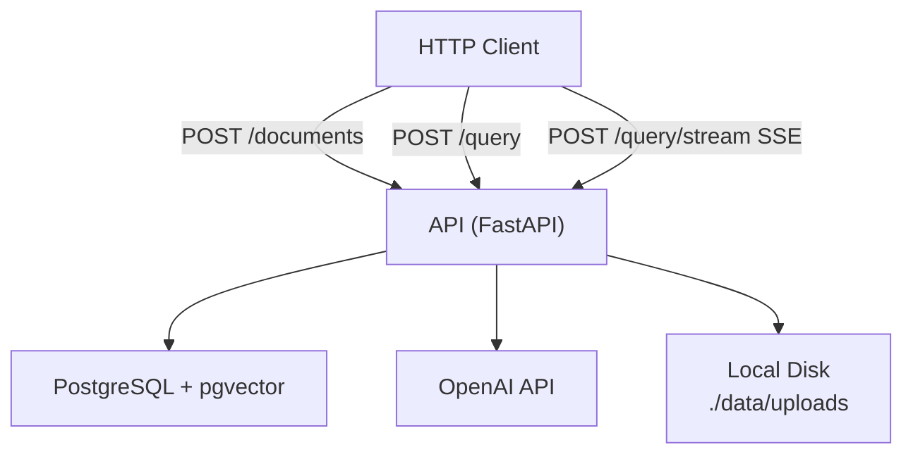
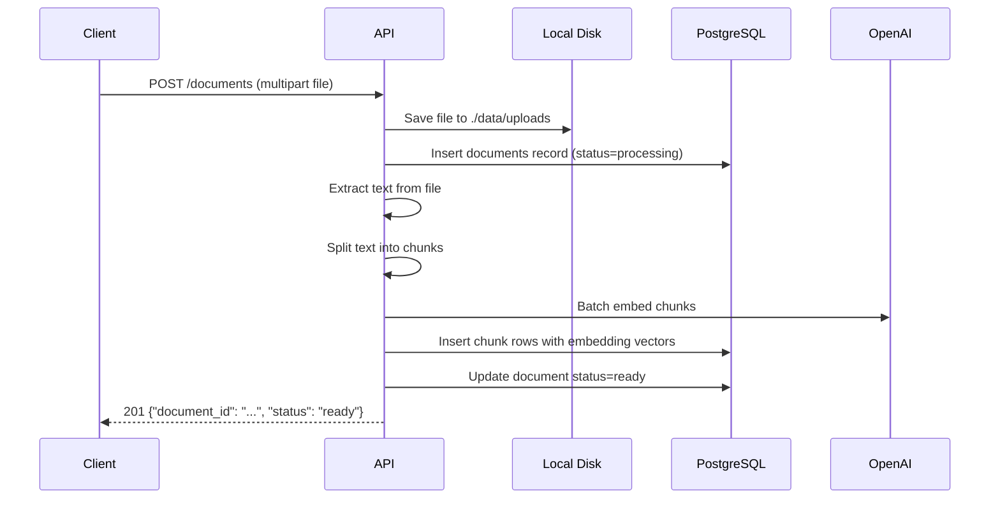
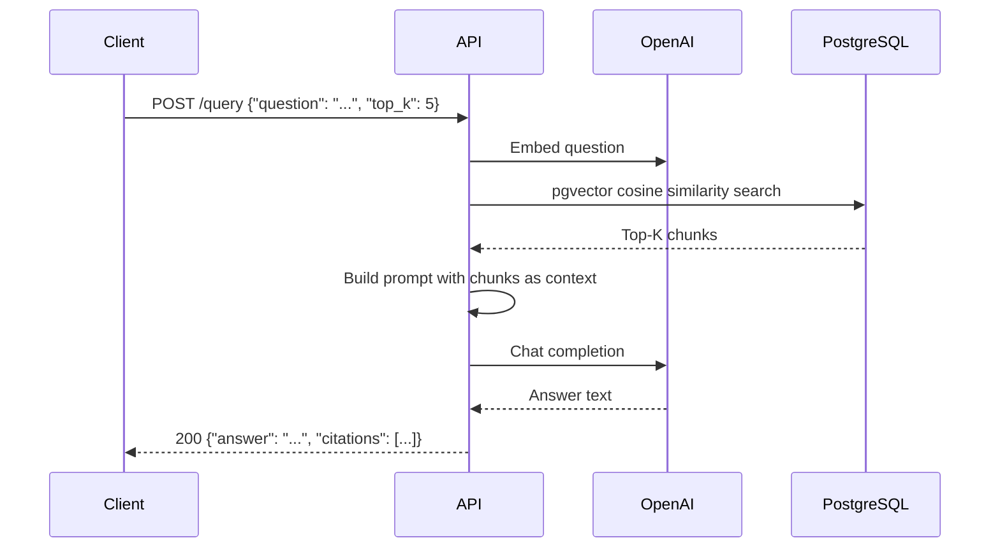
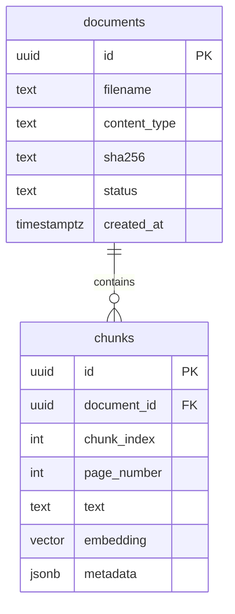
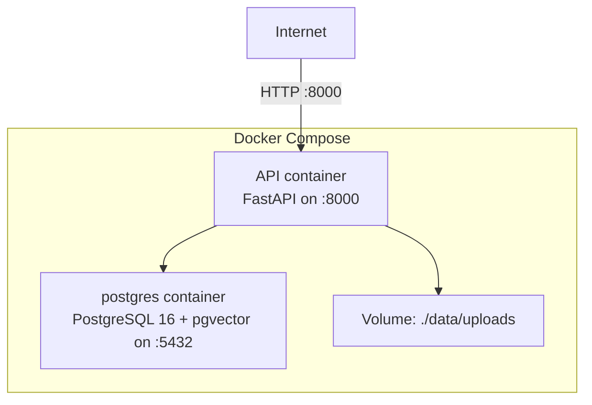

# Architecture

**rag-api**

---

## System Overview

A single-service RAG (Retrieval-Augmented Generation) backend. Clients upload documents; the API extracts text, chunks it, generates embeddings via OpenAI, and stores vectors in PostgreSQL with pgvector. Clients then ask questions; the API embeds the query, retrieves the most relevant chunks by cosine similarity, builds a prompt, and calls the OpenAI chat API to generate a grounded answer with citations. A streaming variant delivers tokens incrementally via SSE.

Phase 1 is a single Docker Compose stack: API + PostgreSQL. No Redis, no workers, no cloud infra.

---

## Component Map



---

## Request Lifecycle — Document Upload



---

## Request Lifecycle — Query



For `POST /query/stream`, the final step streams SSE tokens instead of buffering the full response.

---

## Data Model



`status` values: `uploaded` → `processing` → `ready` | `failed`

---

## Services

### API Service (`app/`)

FastAPI application handling all client requests. No auth in Phase 1.

Routers are thin — they validate input and delegate to services:

| Router | Path | Delegates to |
|---|---|---|
| health.py | GET /health | — |
| documents.py | POST /documents | ingestion.py |
| query.py | POST /query | retrieval.py + generation.py |
| query.py | POST /query/stream | retrieval.py + generation.py (streaming) |

### Service Layer (`app/services/`)

| Module | Responsibility |
|---|---|
| ingestion.py | Orchestrates: extract → chunk → embed → store |
| chunking.py | Split text into overlapping chunks (~700 tokens, 80 overlap) |
| embedding.py | Batch embed chunks via OpenAI; retry once on failure |
| retrieval.py | Embed query; pgvector cosine search; return top-K chunks |
| generation.py | Build context prompt; call LLM; parse answer + citations |

### Providers (`app/providers/`)

| Module | Responsibility |
|---|---|
| openai_client.py | OpenAI SDK wrapper (embeddings + chat completions) |

All OpenAI calls go through this module — services never import the SDK directly.

---

## Infrastructure

Phase 1: Docker Compose only.



---

## API Design

Style: **REST**

| Method | Path | Request | Response |
|---|---|---|---|
| GET | /health | — | `{"status": "ok"}` |
| POST | /documents | multipart file | `{"document_id": "...", "status": "ready"}` |
| POST | /query | `{"question": "...", "top_k": 5}` | `{"answer": "...", "citations": [...]}` |
| POST | /query/stream | `{"question": "...", "top_k": 5}` | SSE token stream |

Citation schema:
```json
{
  "document_id": "...",
  "chunk_id": "...",
  "page": 3,
  "excerpt": "..."
}
```

---

## Key Architecture Decisions

| Decision | Choice | Justification |
|---|---|---|
| Inline ingestion | Synchronous on upload | Phase 1 scale is tiny; simpler than async workers |
| msgspec for schemas | msgspec.Struct | Faster than Pydantic; consistent with framework standard |
| providers/ directory | OpenAI wrapper | Isolates SDK dependency; easy to add Anthropic etc. in Phase 2 |
| pgvector | PostgreSQL extension | No separate vector DB needed; reduces operational complexity |
| Local file storage | ./data/uploads | Simplest option for Phase 1; swap to S3 in Phase 2 without changing routers |

---

## Open Questions / Known Limitations

- No authentication in Phase 1 — API is fully open
- Ingestion is synchronous — large PDFs will block the request thread
- No document management API (list, delete) in Phase 1
- Chunking uses character-count approximation for token size — add tiktoken in Phase 2 for exactness
- Citations are extracted via prompt engineering — may occasionally be imprecise
