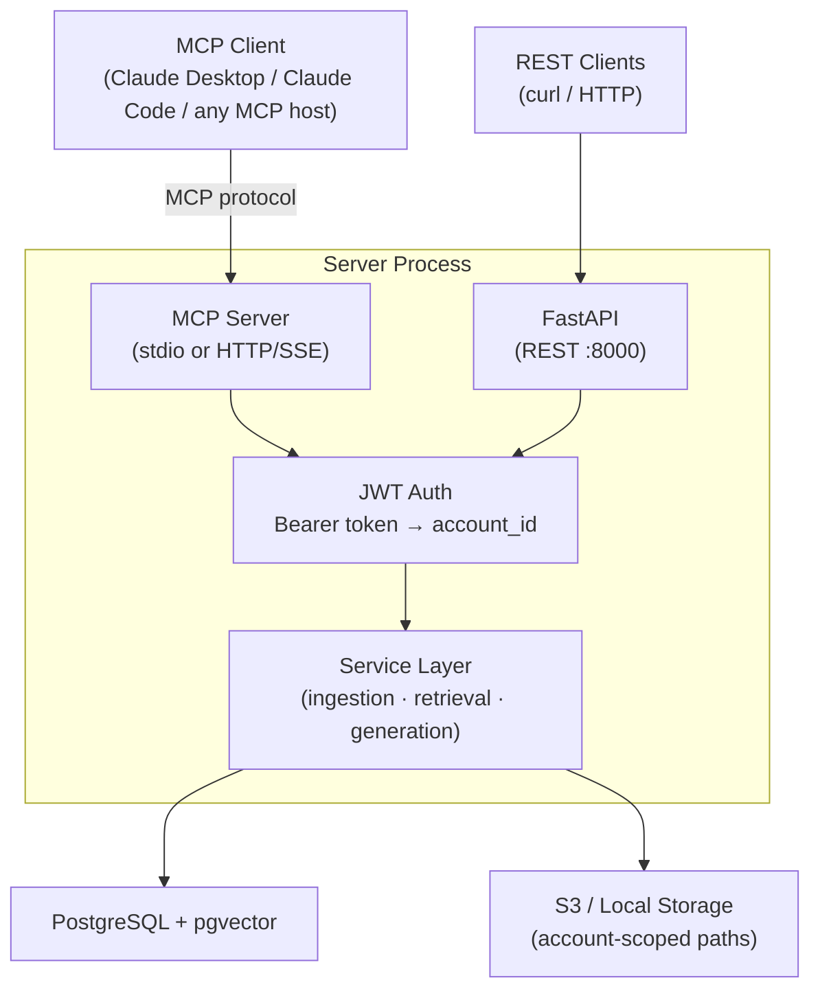

# Phase 2 Plan — MCP Server + Multi-Tenancy

**Generated**: 2026-03-09
**Status**: Planning

---

## Goal Change from Original Phase 2

The original Phase 2 scope was "production hardening" (Redis workers, API key auth, S3, cloud deployment). That scope is being replaced with a more focused goal:

> **Deliver this RAG pipeline as an MCP server** — so any Claude client (Claude Desktop, Claude Code, or any MCP-compatible host) can connect to it, bring their own session token, and query only their own documents.

Original Phase 2 items that survive: S3 storage, document management (list/delete). Items dropped or deferred: Redis async worker (Phase 3), cloud deployment (Phase 3).

---

## What is MCP?

The [Model Context Protocol](https://modelcontextprotocol.io) is Anthropic's open standard for connecting AI systems to tools and data sources. An MCP server exposes **tools** that an AI host can call on behalf of the user.

This RAG API becomes an MCP server. Claude (or any MCP-compatible AI) calls tools like `upload_document` and `query_documents` directly — no HTTP client or curl required.

---

## Architecture Overview



The REST API (FastAPI) remains alongside the MCP server — they share the same service layer. No logic is duplicated.

---

## Auth Pattern

**Why not API keys?** API keys work well for REST but are awkward for MCP. MCP clients are configured with connection details (transport URL or command + args) and the token is passed as an environment variable or Bearer header. There's no concept of "attach a header to every HTTP call" in the same way.

**Chosen approach: JWT Bearer tokens**

- Each tenant is issued a signed JWT containing their `account_id` as the `sub` claim
- For **stdio MCP**: token is set as `MCP_AUTH_TOKEN` env var in the MCP client config
- For **HTTP MCP**: token is passed as `Authorization: Bearer <token>` header
- The server decodes and verifies the JWT on every call — no DB lookup needed (stateless)
- Token issuance is out of scope for Phase 2 (tokens are generated and distributed manually or via a separate auth system)

```python
# Example JWT payload
{
  "sub": "acct_abc123",   # account_id
  "iat": 1234567890,
  "exp": 1234999999       # optional expiry
}
```

---

## Multi-Tenancy Design

**Principle**: every piece of data is owned by an `account_id`. Users can only see and operate on their own data.

### DB Changes

Add `account_id TEXT NOT NULL` to the `documents` table. Chunks are scoped transitively via their `document_id` foreign key. An index on `(account_id)` ensures fast per-tenant queries.

### Storage Changes

All stored files are prefixed with the `account_id`:

- **Local**: `./data/uploads/{account_id}/{uuid}_{filename}`
- **S3**: `s3://{bucket}/{account_id}/{uuid}_{filename}`

A `StorageService` abstraction handles both backends. The active backend is selected via `STORAGE_BACKEND=local|s3` config.

---

## MCP Tools Exposed

| Tool | Description |
|---|---|
| `upload_document` | Upload a document (base64-encoded content + filename). Runs full ingestion pipeline. |
| `query_documents` | Run a RAG query against the caller's documents. Returns answer + citations. |
| `list_documents` | List all documents owned by the caller. |
| `delete_document` | Delete a document and all its chunks. |

All tools are scoped to the caller's `account_id` — they cannot access other tenants' data.

---

## Transport Support

| Transport | Use case | Config |
|---|---|---|
| `stdio` | Claude Desktop, Claude Code — process spawned locally | Token in `MCP_AUTH_TOKEN` env var |
| `HTTP/SSE` | Remote deployment — connect via URL | Token in `Authorization: Bearer` header |

The MCP server supports both transports via a startup flag: `--transport stdio` or `--transport http`.

---

## Task Breakdown

| Task | Type | Depends On |
|---|---|---|
| P2-01: Multi-tenancy schema | infrastructure | — |
| P2-02: Auth service (JWT → account_id) | feature | P2-01 |
| P2-03: Storage service refactor (abstract + S3) | feature | P2-01 |
| P2-04: Document management endpoints | feature | P2-02 |
| P2-05: MCP server | feature | P2-02, P2-03, P2-04 |
| P2-06: Phase 2 test suite | testing | P2-05 |

Tasks P2-02 and P2-03 can be built in parallel after P2-01.

---

## Revised Decision Slots

| Slot | Phase 1 | Phase 2 |
|---|---|---|
| `auth_method` | `none` | `jwt_bearer` |
| `multitenancy` | `no` | `account_id_scoped` |
| `file_storage` | `local` | `local \| s3` (configurable) |
| `api_style` | `rest` | `rest + mcp` |
| `deployment_target` | `docker_compose` | `docker_compose` (HTTP transport adds cloud path) |

---

## New Environment Variables

```
# Auth
JWT_SECRET=<strong-random-secret>
JWT_ALGORITHM=HS256

# Storage backend
STORAGE_BACKEND=local          # or "s3"

# S3 (only required when STORAGE_BACKEND=s3)
S3_BUCKET=my-rag-bucket
S3_REGION=us-east-1
AWS_ACCESS_KEY_ID=...
AWS_SECRET_ACCESS_KEY=...

# MCP (stdio mode)
MCP_AUTH_TOKEN=<jwt>           # set in MCP client config
```

---

## What Does NOT Change

- The service layer (`ingestion.py`, `chunking.py`, `embedding.py`, `retrieval.py`, `generation.py`) is unchanged — it gains an `account_id` parameter where needed
- The REST API endpoints remain functional alongside the MCP server
- PostgreSQL + pgvector remain the vector store
- sentence-transformers (local) remains the embedding provider; Anthropic Claude remains the LLM
- Docker Compose remains the local dev environment

---

## Deferred to Phase 3

- Async ingestion worker (Redis + background worker service)
- Hybrid search (BM25 + vector)
- Reranking
- Cloud deployment (Fly.io / ECS Fargate)
- OAuth2 / token issuance service
