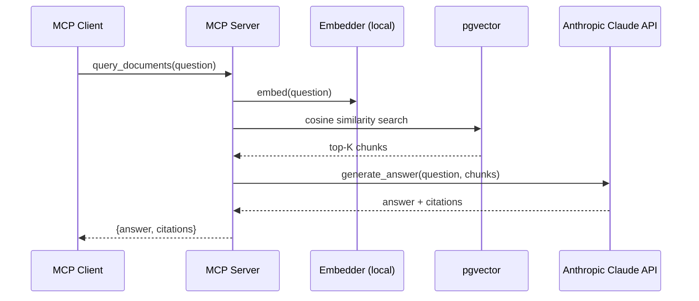
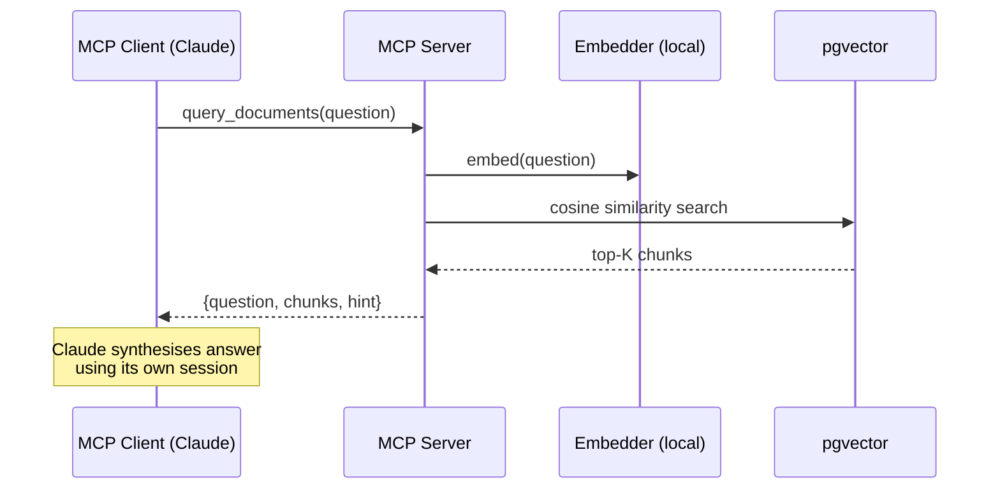
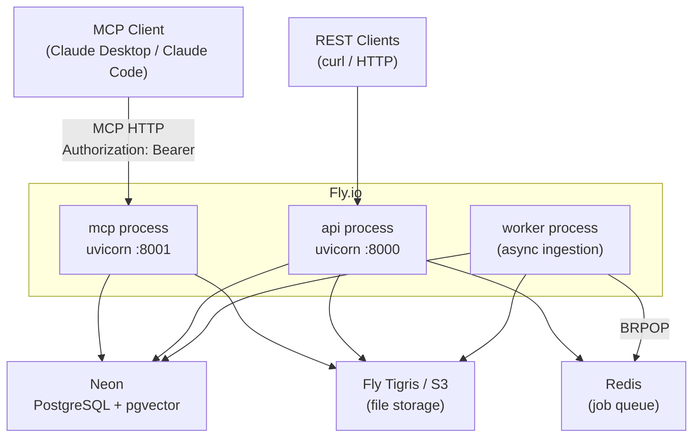
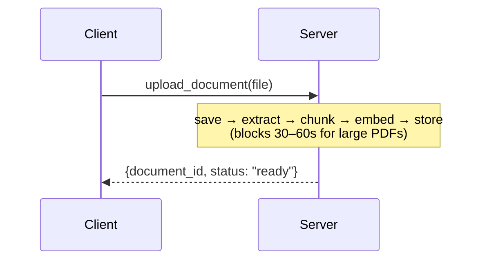
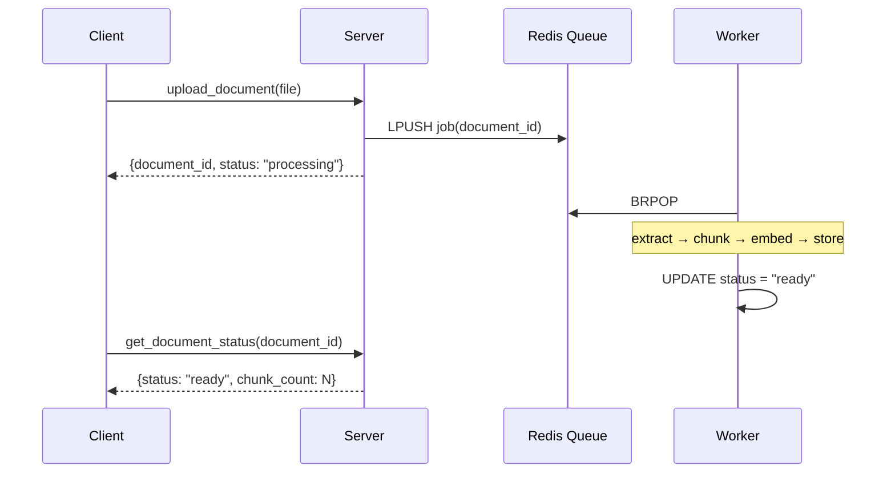

# Phase 3 Plan — MCP-Native Redesign, Cloud Deployment & Search Quality

**Generated**: 2026-03-09
**Status**: Planning

---

## Problems to Solve

### 1. The API Key Problem (Most Urgent)

The current `query_documents` MCP tool calls the Anthropic API server-side to generate an answer. This means:

- The MCP server needs its own `ANTHROPIC_API_KEY`
- LLM usage burns the server's API budget, not the caller's
- Users on Claude Code Pro or Claude Desktop are paying twice — once for their subscription and once for the server's API key
- It's architecturally wrong for MCP: tools should return **data**, not pre-synthesised answers

**Fix**: Make `query_documents` return retrieved chunks as structured context. The calling Claude session synthesises the answer using its own context window and token budget. This is the idiomatic MCP pattern.

The REST `POST /query` and `POST /query/stream` endpoints keep server-side generation — they're designed for non-Claude clients that need a complete answer without a capable LLM at the call site.

After this change: **the MCP server requires no `ANTHROPIC_API_KEY`**. Embeddings are already local (sentence-transformers). The server becomes retrieval-only.

---

### 2. The Local Postgres Problem

Running the MCP server in stdio mode requires PostgreSQL running locally. Users need Docker running just to use their knowledge base. This is a significant friction point.

**Fix**: Cloud deployment. The MCP server becomes a remote HTTP endpoint (`https://your-app.fly.dev/mcp`). Users configure their MCP client with a URL, not a local command. No local infrastructure needed.

---

### 3. Synchronous Ingestion Blocks Tool Calls

Large PDFs can take 30–60 seconds to ingest. During that time the MCP tool call hangs. Claude Code/Desktop will time out or appear frozen.

**Fix**: Async ingestion via a Redis-backed worker. `upload_document` returns immediately with a job ID; status can be polled with `get_document_status`.

---

## Phase 3 Scope

| Task | Type | Priority |
|---|---|---|
| P3-01: MCP-native query (return context, not answer) | redesign | P0 — must ship first |
| P3-02: Cloud deployment (Fly.io + Neon) | infrastructure | P1 |
| P3-03: Async ingestion (Redis + worker) | feature | P1 |
| P3-04: Hybrid search (BM25 + vector) | quality | P2 |
| P3-05: Reranking (cross-encoder) | quality | P2 |
| P3-06: Collections + enhanced document management | feature | P2 |

---

## P3-01: MCP-Native Query Redesign

### Current behaviour



### New behaviour (P3-01)



The returned `chunks` become context in the calling Claude session's conversation. Claude synthesises the answer naturally, can ask follow-up questions, cite sources itself, and uses the caller's own token budget.

### What doesn't change

`POST /query` (REST) keeps server-side generation. It calls the LLM and returns `{answer, citations}` — this is the right design for non-Claude HTTP clients.

### Impact

- `ANTHROPIC_API_KEY` is no longer required for MCP use
- `providers/ai_client.py` and `services/generation.py` are still used by the REST API — do not remove them
- `query_documents` return schema changes — update tool description accordingly

---

## P3-02: Cloud Deployment (Fly.io + Neon)

### Stack

| Service | Provider |
|---|---|
| API + MCP server | [Fly.io](https://fly.io) — single app, two process groups |
| PostgreSQL + pgvector | [Neon](https://neon.tech) — serverless postgres, pgvector built in |
| File storage | AWS S3 (or Fly.io Tigris — S3-compatible, same region) |

### Why Fly.io + Neon

- Fly.io: simple `fly.toml`, `fly deploy` in CI, scales to zero, cheap
- Neon: serverless postgres with pgvector built in — no extension management, free tier, connection pooling included
- Fly.io Tigris: S3-compatible object storage in the same region as your Fly.io app (lower latency, same billing)
- No CDK, no ECS, no complex infra — this is a single-service app

### Architecture After Deployment



### What Users Configure

No local infrastructure. MCP client config becomes:

```json
{
  "mcpServers": {
    "rag-api": {
      "url": "https://rag-api.fly.dev/mcp",
      "headers": {
        "Authorization": "Bearer <jwt>"
      }
    }
  }
}
```

Token generation stays the same — users generate their own JWT with the shared `JWT_SECRET`.

---

## P3-03: Async Ingestion

### Current flow (synchronous)



### New flow (async)



### Implementation

- Redis list as a job queue (`LPUSH` on upload, `BRPOP` in worker)
- Worker is a separate Python process (`app/worker.py`) running in its own Fly.io process group
- New MCP tool: `get_document_status(document_id)` — polls until ready
- `docker-compose.yml` gains a `redis` service and `worker` service for local dev

---

## P3-04: Hybrid Search (BM25 + Vector)

### Problem with pure vector search

Dense vector search finds semantically similar content but misses exact keyword matches. "What is the TF-IDF score?" matches poorly on vector search if the document only uses "term frequency" — vectors are close but BM25 on the keyword "TF-IDF" would nail it.

### Approach: Reciprocal Rank Fusion (RRF)

Run both searches in parallel, combine with RRF:

```python
combined_score = Σ 1 / (k + rank_i)
```

- Vector search: pgvector cosine similarity (existing)
- BM25 search: PostgreSQL full-text search (`tsvector` / `tsquery`) — no new infrastructure
- RRF merges results, re-sorts by combined score

BM25 via PostgreSQL FTS avoids adding a new service. Add a `tsvector` column to `chunks`, populate it on insert, index with GIN.

---

## P3-05: Reranking

### Problem with retrieval-only scoring

Vector similarity (and even BM25) score chunks individually. They miss cross-chunk relevance — a chunk might score high in isolation but be less useful than another given the full question.

### Approach: Cross-encoder reranking

After retrieval, run a cross-encoder (question, chunk) → relevance score. This is slower than vector search but operates on a small candidate set (e.g., top-20 → rerank → return top-5).

```python
# pipeline:
# 1. Retrieve top-20 via hybrid search
# 2. Cross-encoder scores each (question, chunk) pair
# 3. Re-sort by cross-encoder score, return top-k
```

Model: `cross-encoder/ms-marco-MiniLM-L-6-v2` from sentence-transformers — fast, 80MB, runs locally.

Reranking is opt-in: `query_documents(question, top_k=5, rerank=True)`.

---

## P3-06: Collections + Enhanced Document Management

### Collections (Namespaces)

Group documents into named collections so queries can be scoped:

```
query_documents(question, collection="legal-docs")
upload_document(filename, content_b64, collection="legal-docs")
list_collections()
```

DB: add `collection TEXT NOT NULL DEFAULT 'default'` to `documents`.

### Re-indexing

Re-embed all chunks for a document with the current `EMBED_MODEL`. Useful when switching embedding models.

New MCP tool: `reindex_document(document_id)`.

### More File Formats

- `.docx` — via `python-docx`
- `.html` — via `beautifulsoup4` (strip tags, extract text)
- `.csv` — each row becomes a chunk

### Document Metadata

Allow attaching arbitrary key-value metadata at upload time:

```json
upload_document(filename, content_b64, metadata={"source": "Q4 report", "year": "2025"})
```

Metadata stored as JSONB on `documents`. Filterable in queries.

---

## Suggested Improvements (Backlog)

These are lower priority but worth noting for Phase 4+:

| Improvement | Value |
|---|---|
| Token usage accounting | Track embedding + generation tokens per account |
| Usage dashboard / admin API | `GET /admin/usage` — document counts, storage bytes, token usage |
| Rate limiting | Per-account request rate limits (slowapi) |
| Webhook on ingestion complete | Notify a URL when async ingestion finishes |
| Document expiry | TTL on documents — auto-delete after N days |
| Duplicate detection | Skip re-ingestion if sha256 already exists for account |
| Tiktoken-based chunking | Accurate token counting instead of character approximation |
| Streaming query via MCP | MCP supports streaming tool responses — expose `query_stream` as a tool |
| Web UI | Minimal Next.js frontend for document management |
| OAuth2 / token issuance | Self-serve token generation for new accounts |

---

## Revised Decision Slots

| Slot | Phase 2 | Phase 3 |
|---|---|---|
| `mcp_query_mode` | `server_generates_answer` | `returns_context` |
| `deployment_target` | `docker_compose` | `fly_io` |
| `database` | `local_postgres` | `neon_serverless_postgres` |
| `file_storage` | `local \| s3` | `fly_tigris \| s3` |
| `background_jobs` | `none` | `redis_worker` |
| `search_mode` | `vector_only` | `hybrid_bm25_vector` |
| `reranking` | `none` | `cross_encoder_optional` |

---

## New Environment Variables (Phase 3)

```bash
# Async ingestion (P3-03)
REDIS_URL=redis://localhost:6379/0

# Hybrid search (P3-04) — no new vars, uses existing PostgreSQL

# Reranking (P3-05)
RERANK_MODEL=cross-encoder/ms-marco-MiniLM-L-6-v2

# Cloud deployment (P3-02)
FLY_APP_NAME=rag-api
# DATABASE_URL points to Neon instead of local postgres
# S3_* vars point to Fly Tigris instead of AWS
```
